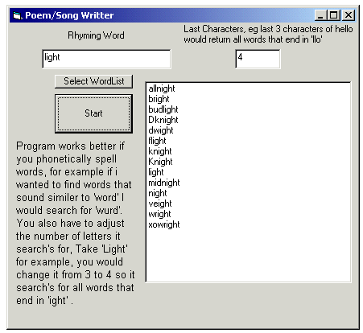



## Song/Poem Assistant

### Description

This program searches through a list of words and tries to find words that sound similar to the one you are looking for, such as Light and Bright. Quite simple.

Keywords: Wordlist, list character rhyme common controls
 
### More Info
 

             |
---                |---
**Submitted On**   |2003-07-02 05:32:02
**By**             |[Peter Rowan](https://github.com/Planet-Source-Code/PSCIndex/blob/master/ByAuthor/peter-rowan.md)
**Level**          |Beginner
**User Rating**    |4.6 (23 globes from 5 users)
**Compatibility**  |VB 6\.0
**Category**       |[String Manipulation](https://github.com/Planet-Source-Code/PSCIndex/blob/master/ByCategory/string-manipulation__1-5.md)
**World**          |[Visual Basic](https://github.com/Planet-Source-Code/PSCIndex/blob/master/ByWorld/visual-basic.md)
**Archive File**   |[Song\_Poem\_160870722003\.zip](https://github.com/Planet-Source-Code/peter-rowan-song-poem-assistant__1-46598/archive/master.zip)

